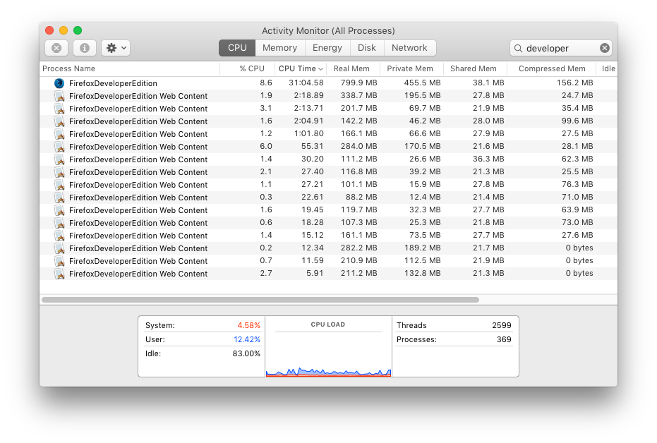

# Manage CPU/RAM with Firefox and e10s

This is about [e10s](https://wiki.mozilla.org/Electrolysis) in [Firefox Developer Edition](https://www.mozilla.org/en-US/firefox/developer/).  e10s is short for * Electrolysis* (e + 10 letters + s) and it is a new feature in Firefox that uses a separate process per tab. It ultimately means a more responsive and stable Firefox. 

On my laptop, I often wonder why Firefox is using so much CPU. Particularly since the tabs I have open don't seem to be doing much. With e10s enabled it's easier to identify which tabs are CPU and memory hogs. 

1. Download [Firefox Developer Edition]((https://www.mozilla.org/en-US/firefox/developer/))
2. In the location bar go to: `about:config`
3. Set `dom.ipc.processorCount` to `32`. I chose this arbitrarily and it seems to be alright. 
4. Use Firefox, make some new tabs, browse some stuff.

On OSX, start up Activity Monitor and filter for `developer`:

You can't see which URLs are opened in the tabs but you can see which ones are using the most RAM and CPU. Choosing one and Force Quitting will kill the tab, but not Firefox. 

In Firefox you'll see this error message:

While this is a pretty weird way to interact with your browser, it is nice to have some level of control and visibility into which page is being a CPU hog. Usually, it's the page that runs the most background javascript or an extension.