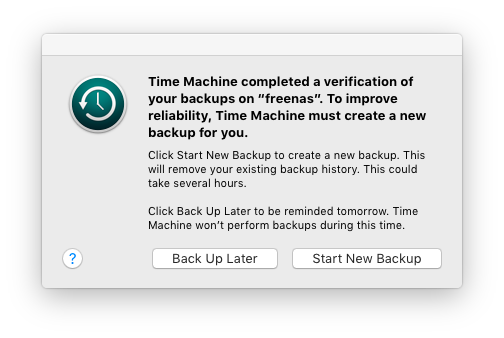

# Protect against corrupt timemachine backups with ZFS on FreeNAS

This happens occationally with Timemachine backing up to my FreeNAS server: 

It seems this error occures sometimes when backing up to a non Apple NAS. Since FreeNAS uses ZFS it possible to use automatic ZFS snapshots of timemachine's backups to rollback to a stable state. 

This is the process for fixing it:

1. Stop the AFP service
2. Revert the latest snapshot (Storage > Snapshots)
3. Turn AFP back on 
4. Trigger a new backup

This saves having to do a full backup which can take hours over wifi. Depending on how far behind the backup is it may take a while for OSX to calculate what needs to be done in the new incremental backup. I've used this several times now to happy success. 